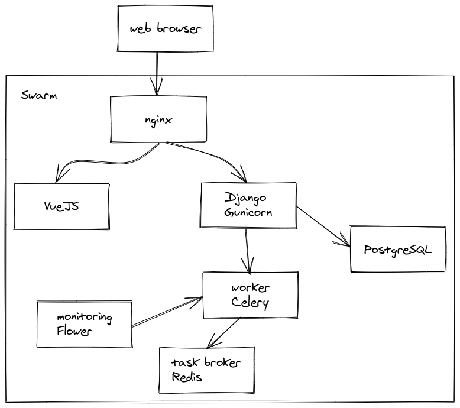
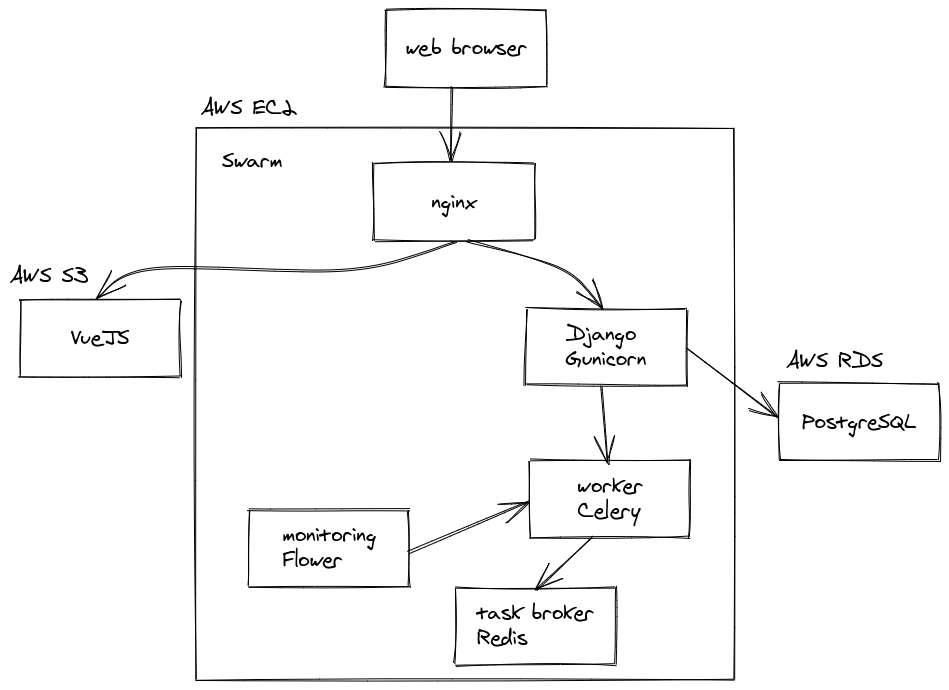

# fullstack-django-vuejs

This is a Fullstack test project, and use.

* [Ansible](https://docs.ansible.com/ansible/latest/index.html)
* [Docker](https://docs.docker.com/get-started/)
* [Swarm](https://docs.docker.com/engine/swarm/)
* [Django 2.2.13](https://docs.djangoproject.com/en/2.2/)
* [VueJS](https://vuejs.org/v2/guide/)
* [Nginx](https://nginx.org/en/docs/)
* [PostgreSQL](https://www.postgresql.org/docs/)
* [Celery](https://docs.celeryproject.org/en/stable/getting-started/introduction.html)
* [Redis](https://redis.io/documentation)
* [Flower](https://flower.readthedocs.io/en/latest/)

[Deploy na AWS](#deploy-na-aws)

## Architecture



## AWS Architecture




## How to run project?

```
git clone https://github.com/rg3915/fullstack-django-vuejs.git
cd fullstack-django-vuejs
cp backend/contrib/env_sample .env
docker-compose -f docker-compose.dev.yml up --build -d
```


Enter in container and create super user:

```
docker container exec -it \
fullstack-django-vuejs_app_1 \
python manage.py createsuperuser \
--username="admin"
```

**Tips**:

* Dont use `postgres:12` because it does not allow Django `migrate` to work.
* Do not set `hostname` in `db` because it interferes with the comunication between Django and database.
* Do not set `container_name` in services because it interferes with the comunication between `nginx` e a `app`.

* Não use `postgres:12` porque ele não permite que o Django `migrate` funcione.
* Não defina `hostname` em `db` porque interfere na comunicação entre o Django e o banco.
* Não defina `container_name` nos serviços porque interfere na comunicação entre o `nginx` e a `app`.


## [Portainer](https://www.portainer.io/)

```
docker run -d \
-p 9000:9000 \
--restart always \
-v /var/run/docker.sock:/var/run/docker.sock \
-v /opt/portainer:/data \
portainer/portainer
```

## Ports

Portainer: `localhost:9000`

Backend: `localhost/api/users/`

Flower: `localhost:5555/monitor`


## Running Celery

Without `queue`.

```
celery --app=myproject worker --loglevel=INFO
```

With `queue`.

```
celery --app=myproject worker --loglevel=INFO --queue=fila1
```

## Flower monitoring the tasks

The [flower](https://flower.readthedocs.io/en/latest/) monitoring Celery in realtime.

```
celery -A myproject flower
```

If stress Celery type and see in monitor

```
for i in $(seq 10); do curl localhost/task/print_numbers/; sleep 1; done
```


### django-celery-results

https://django-celery-results.readthedocs.io/en/latest/

```
python manage.py migrate django_celery_results
```

### Frontend

Add hoc

```
docker build -f DockerfileVueJS -t vuejs-app .

docker run -it -p 8080:8080 \
--rm --name vuejs \
vuejs-app
```

### Observações

Em produção tive que configurar algumas coisas manualmente:

* Criei banco de dados PostgreSQL na RDS.
* Configurei endpoint no VueJS manualmente.
* Liberei as portas 80, 8080 e 9000 no Security Group.


## Deploy na AWS

1. Criar banco PostgreSQL na [AWS RDS](https://aws.amazon.com/pt/rds/).
2. Criar uma instância Ubuntu na [AWS EC2](https://aws.amazon.com/pt/ec2/).
3. Conectar no servidor via ssh.

### Crie alguns alias dentro do `~/.bashrc`

```
alias l='clear; ls -lF'
alias rm='rm -i'
alias h=history
alias python=python3
alias pip=pip3
# Git
alias g='git'
alias gp='git push origin HEAD'
```

E faça `source ~/.bashrc`

### Vim

Se quiser configure seu `~/.vimrc` para usar 4 espaços.

https://stackoverflow.com/questions/234564/tab-key-4-spaces-and-auto-indent-after-curly-braces-in-vim/234578#234578

Eu gosto de deixar minha configuração assim:

```
set encoding=utf-8
set number          " show line numbers
set expandtab       " use spaces instead of tabs
set autoindent      " autoindent based on line above
set smartindent     " smarter indent for C-like languages
set shiftwidth=4    " when using Shift + > or <
set softtabstop=4   " in insert mode
set tabstop=4       " set the space occupied by a regular tab
```

Eu tenho um `.vimrc` mais completo em

https://gist.github.com/rg3915/57b489c1751c384b3ad614c492478df0


1. Rodar o script `deploy_aws.sh`.

Antes configure corretamente a conexão com o banco de dados.

* Conectar no RDS e criar o database. O RDS já define o nome do banco, você pode editar.

Na se esqueça de definir acesso público ao banco.

```
psql \
--host=url \
--port=5432 \
--username=postgres \
--password \
--dbname=nomedobanco

 CREATE ROLE rg3915 ENCRYPTED PASSWORD 'tistysterappikeliessemssystiflow' LOGIN;
```

Crie um `.env`

```
cat << EOF > .env
DEBUG=True
SECRET_KEY=YTNlZjk5OTY4YjNlOWUxZjBkYTQwNzc2ZDZiMmVhNmU2ZmZlZG
ALLOWED_HOSTS=*
DB_HOST=URL
POSTGRES_DB=dbloxodonta
POSTGRES_USER=rg3915
POSTGRES_PASSWORD=tistysterappikeliessemssystiflow
APP_ID=xyz
KEY=xyz
SECRET=xyz
CLUSTER=xyz
EOF
```


Finalmente rode o script:

```
chmod +x deploy_aws.sh
./deploy_aws.sh
```


2. Liberar as portas de conexão no *AWS security groups*.
3. O site já está no ar a partir do IP público.


### Links

https://medium.com/@mdcg.dev/configurando-um-sistem-em-django-para-executar-tarefas-ass%C3%ADncronas-utilizando-celery-redis-e-53a30d0d2ec2

https://stackoverflow.com/a/54162975/802542

https://mattsegal.dev/django-prod-architectures.html

https://www.youtube.com/watch?v=3lD7zdwSYaU

https://docs.ansible.com/ansible/latest/modules/docker_container_module.html#examples

https://gist.github.com/mosquito/b23e1c1e5723a7fd9e6568e5cf91180f

https://medium.com/codefactory/practical-devops-1-automagically-deploy-your-vue-js-app-to-aws-c3de080849f9

https://nodejs.org/fr/docs/guides/nodejs-docker-webapp/
